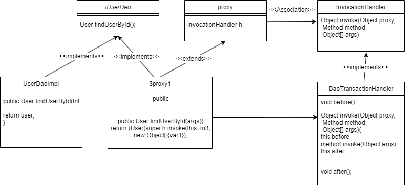

# 代理模式

## What is that

代理模式是一种结构型设计模式，它允许通过创建一个代理对象来控制原始对象的访问。代理对象充当一个中介，通过在客户端和目标对象之间建立通信桥梁，帮助管理对目标对象的访问。代理类在接收到客户端的请求时，可以在执行具体操作之前或之后，对原始对象进行额外的处理，和如果我需要执行某段程序前想要输出日志，我不需要每次都将日志输出代码都写入代码块里，造成代码冗余。

## How to use it

```java
package shen.dao;

import shen.entity.User;

public interface IUserDao {
    /*
    * 查找单个用户
    * */

    User findUserById(Integer id);
}
```

```java
package shen.dao.impl;

import shen.dao.IUserDao;
import shen.entity.User;

public class UserDaoImpl implements IUserDao {

    @Override
    public User findUserById(Integer id) {

        User user = new User(0,"you catch me","Hi");
        return user;
    }
}

```

```java
package shen.entity;

public class User {
    private Integer id;
    private String username;
    private String password;

    public User() {}
    public User(Integer id, String username, String password) {
        this.id = id;
        this.username = username;
        this.password = password;
    }

    public Integer getId() {
        return id;
    }

    public void setId(Integer id) {
        this.id = id;
    }

    public String getUsername() {
        return username;
    }

    public void setUsername(String username) {
        this.username = username;
    }

    public String getPassword() {
        return password;
    }

    public void setPassword(String password) {
        this.password = password;
    }

    @Override
    public String toString() {
        return "User{" +
                "id=" + id +
                ", username='" + username + '\'' +
                ", password='" + password + '\'' +
                '}';
    }
}
```

```java
package shen.handler;
import shen.dao.IUserDao;
import shen.dao.impl.UserDaoImpl;
import shen.entity.User;

public class ProxyHandler implements IUserDao {


    public void before() {
        System.out.println("turn on transaction");
    }
    @Override
    public User findUserById(Integer id) {
        this.before();
        UserDaoImpl userDao = new UserDaoImpl();
        User user = userDao.findUserById(id);
        System.out.println(user);
        this.after();
        return user;
    }
    public void after() {
        System.out.println("turn off transaction");
    }
}
```

```java
package shen.test;

import shen.entity.User;
import shen.handler.ProxyHandler;

public class test {
    public static void main(String[] args) {
        IUserDao proxyHandler = new ProxyHandler();
        proxyHandler.findUserById(0);
    }
}
```output
turn on transaction
User{id=0, username='You catch me', password='Hi'}
turn off transaction
```

通过这样静态代理实现接口的方式用proxyHandler实现获取User的同时还完成了after()，与before()两个方法

## Why

代理模式存在的原因是为了达到一些额外的目的，例如：提供一些额外的安全措施、控制对资源的访问、实现懒加载等。通过代理模式，我们可以灵活地管理和控制对目标对象的访问。

# JDK动态代理

## What is that

如果每个类都自己实现编写静态代理，不仅麻烦而且会导致程序非常复杂，这时可以用到JDK的动态代理API，JDK动态代理是一种特殊类型的代理模式，它允许在运行时动态生成代理类和代理对象。JDK动态代理需要使用Java的反射机制，利用代理类和InvocationHandler接口来实现代理功能。

## How to use it

在以上代码基础上对handler 包和test包进行更改

```java
package shen.handler;

import shen.dao.IUserDao;

import java.lang.reflect.InvocationHandler;
import java.lang.reflect.Method;

public class DaoTransactionHandler implements InvocationHandler {
//    if other class want use proxy  you can choose Object class
    private Object obj;

    public DaoTransactionHandler(Object obj) {
        this.obj = obj;
    }
    @Override
    public Object invoke(Object proxy, Method method, Object[] args) throws Throwable {
        Object res = null;
//        if you want to enhance just only one method
        if ("findUserById".equals(method.getName())) {
            this.before();
            res = method.invoke(obj,args);
            this.after();
        }else {
            res = method.invoke(args);
        }
        return res;
    }

    private void before() {
        System.out.println("turn on enhance transaction");
    }
    private void after(){
        System.out.println("turn off enhance transaction");
    }
}
```

```java
package shen.test;

import shen.dao.IUserDao;
import shen.dao.impl.UserDaoImpl;
import shen.handler.DaoTransactionHandler;

import java.lang.reflect.Proxy;

public class test {
    public static void main(String[] args) {
//        target Class
        UserDaoImpl userDao = new UserDaoImpl();
//        enhance Class
//        invocation class
        DaoTransactionHandler daoTransactionHandler = new DaoTransactionHandler(userDao);
//        act proxy object
        IUserDao userDaoProxy =(IUserDao) Proxy.newProxyInstance(UserDaoImpl.class.getClassLoader(),
                UserDaoImpl.class.getInterfaces(), daoTransactionHandler);
        userDaoProxy.findUserById(0);

    }
}
```output
turn on enhance transaction
User{id=0, username='you catch me', password='Hi'}
turn off enhance transaction

```

# Why

JDK动态代理的好处在于，它不需要事先编写代理类的源代码，而是在运行时根据需要动态生成代理类和代理对象。这样可以大大简化开发过程，特别是当需要为多个类生成代理时，能够提高代码的灵活性和可维护性。

JDK动态代理的原理是利用了Java的反射机制，通过在运行时创建一个新的类，实现目标类所实现的接口，并在方法调用时使用InvocationHandler的实现类来处理额外逻辑。当代理对象的方法被调用时，JDK动态代理会通过反射将调用转发给InvocationHandler实例中的invoke()方法，从而实现代理功能。

可以集合JDK自动生成的$Proxy的源码分析：

修改test中代码可以生成$Proxy文件

```java
package shen.test;

import shen.dao.IUserDao;
import shen.dao.impl.UserDaoImpl;
import shen.handler.DaoTransactionHandler;
import sun.misc.ProxyGenerator;

import java.io.File;
import java.io.FileOutputStream;
import java.io.IOException;
import java.lang.reflect.Proxy;

public class test {
    public static void main(String[] args) {
//        target Class
        UserDaoImpl userDao = new UserDaoImpl();
//        enhance Class
//        invocation class
        DaoTransactionHandler daoTransactionHandler = new DaoTransactionHandler(userDao);
//        act proxy object
        IUserDao userDaoProxy =(IUserDao) Proxy.newProxyInstance(UserDaoImpl.class.getClassLoader(),
                UserDaoImpl.class.getInterfaces(), daoTransactionHandler);
        userDaoProxy.findUserById(0);
       // path such as "C:\\IdeaProject\\proxyDemo\\src"
        saveProxyClass("__your project path __\\src");

    }
    //writing $proxy to contain in localhost
    private static void saveProxyClass(String path) {
        byte[] $Proxy1s = ProxyGenerator.generateProxyClass("$Proxy1",
                UserDaoImpl.class.getInterfaces());
        FileOutputStream out = null;
        try {
            out = new FileOutputStream(new File(path + "$Proxy1.class"));
            out.write($Proxy1s);
        }catch (Exception e) {
            e.printStackTrace();
        }finally {
            if (out != null) {
                try {
                    out.flush();
                    out.close();
                } catch (IOException e) {
                    throw new RuntimeException(e);
                }

            }
        }
    }
}
```

分析源码

```java
public final class $Proxy1 extends Proxy implements IUserDao {
    private static Method m1;
    private static Method m2;
    private static Method m3;
    private static Method m0;

    public $Proxy1(InvocationHandler var1) throws  {
        super(var1);
    }

    public final boolean equals(Object var1) throws  {
        try {
            return (Boolean)super.h.invoke(this, m1, new Object[]{var1});
        } catch (RuntimeException | Error var3) {
            throw var3;
        } catch (Throwable var4) {
            throw new UndeclaredThrowableException(var4);
        }
    }

    public final String toString() throws  {
        try {
            return (String)super.h.invoke(this, m2, (Object[])null);
        } catch (RuntimeException | Error var2) {
            throw var2;
        } catch (Throwable var3) {
            throw new UndeclaredThrowableException(var3);
        }
    }

    public final User findUserById(Integer var1) throws  {
        try {
            return (User)super.h.invoke(this, m3, new Object[]{var1});
        } catch (RuntimeException | Error var3) {
            throw var3;
        } catch (Throwable var4) {
            throw new UndeclaredThrowableException(var4);
        }
    }

    public final int hashCode() throws  {
        try {
            return (Integer)super.h.invoke(this, m0, (Object[])null);
        } catch (RuntimeException | Error var2) {
            throw var2;
        } catch (Throwable var3) {
            throw new UndeclaredThrowableException(var3);
        }
    }

    static {
        try {
            m1 = Class.forName("java.lang.Object").getMethod("equals", Class.forName("java.lang.Object"));
            m2 = Class.forName("java.lang.Object").getMethod("toString");
            m3 = Class.forName("shen.dao.IUserDao").getMethod("findUserById", Class.forName("java.lang.Integer"));
            m0 = Class.forName("java.lang.Object").getMethod("hashCode");
        } catch (NoSuchMethodException var2) {
            throw new NoSuchMethodError(var2.getMessage());
        } catch (ClassNotFoundException var3) {
            throw new NoClassDefFoundError(var3.getMessage());
        }
    }
}

```

JDK动态代理的原理是利用了Java的反射机制，通过在运行时创建一个新的类，实现目标类所实现的接口，并在方法调用时使用InvocationHandler的实现类来处理额外逻辑。当代理对象的方法被调用时，JDK动态代理会通过反射将调用转发给InvocationHandler实例中的invoke()方法，从而实现代理功能。



以上就是我的理解!
