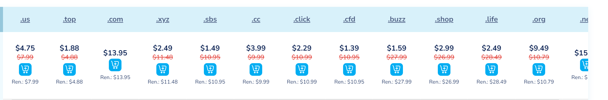

# 构建你自己的 GPT4 聊天窗口

_已经存在[chatGPT](chat.openai.com),[Gemini](https://gemini.google.com/)等等很好的AI聊天对话框、为啥还需要自己构建一个对话框 ?_

<ul>
    <li>1、无法访问他们服务本身</li>
    <li>2、无法访问更高级的模型 : GPT4turbo</li>
</ul>

如果你刚好被以上问题困扰、那你很适合阅读该博文

***准备条件***

<ul>
    <li>openAI 账号</li>
    <li>域名(可选： 反向代理方案)</li>
    <li>github 账号</li>
    <li>信用卡(虚拟)</li>
</ul>

*首先解释一下： 若需要使用 GPT4 服务 本身并不是免费的、所以需要花钱，需要用信用卡支付，如果你只是用GPT3.5的话、更没有必要构建自己的聊天窗口了，直接用官方的即可，花的钱也足够让你买机场好几个月*

***快速开始***

1、进入openAI官网、 获取token(凭证) 保存下来，*想要调用三方服务、少不了付费*

2、购买域名、 利用域名做反向代理是能够在国内访问openai 服务的关键、如果不想每次访问前都要多一步操作、请不要省这点钱 便宜的域名 大概不到<strong>3$ (21RMB)/1 year</strong>，但不要买国内的，国内的使用起来会非常的麻烦(备案)，我购买的是[NameSilo](www.namesilo.com)上面的

3、将域名挂在到[cloudflare](cloudflare.com)上，操作比较简单、大致意思是将域名填到cloudflare上、然后将原本的购买服务商那里的删除 。。。

4、github fork 项目、 该项目[源码](https://github.com/ChatGPTNextWeb/ChatGPT-Next-Web)已经公开了、咱们要做的就是**按照要求、一键部署**

<ul>
    <li>1、进入源码界面</li>
    <li>2、在README中直接点击Deploy</li>
    <li>3、利用Vercel一键部署</li>
</ul>

他会让你先登录、用github关联、会让你fork该项目、然后会让你写~~两~~三个参数：

OPENAI_API_KEY : 填入你openAI 的token即可

CODE : 设置访问你自己网站的访问码/密码

GOOLE_API_KEY : Google API token （可选）

接下来等待即可、傻瓜式部署就完成了、会生成一个随机命名的域名、就可以直接访问了

前面我们说到、自己购买的域名是可以自由访问的关键、因为给的域名随时有可能被墙的风险、所以自己设置一个域名是很有必要的、其次自己的域名可读性也更强，以后只需要记住域名就好了。

5、配置域名、与反向代理page

在cloudflare中新建一个page

...此处省略（不想写了）

