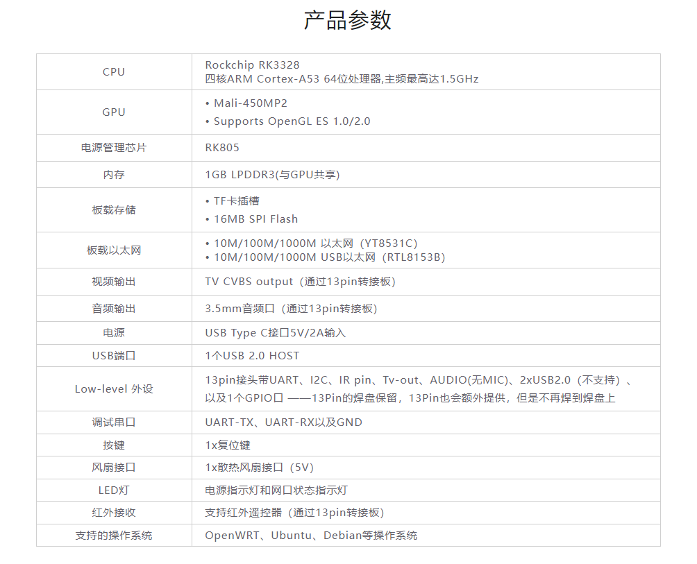
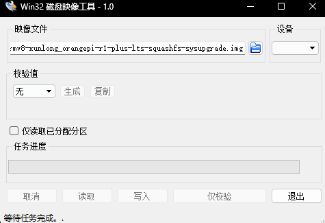
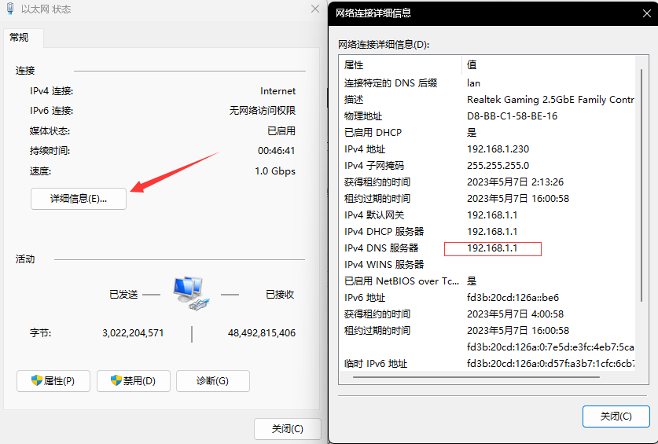
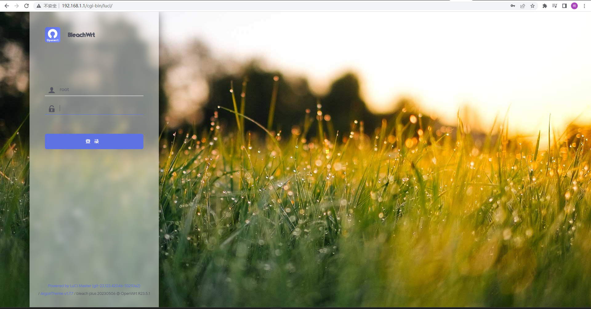
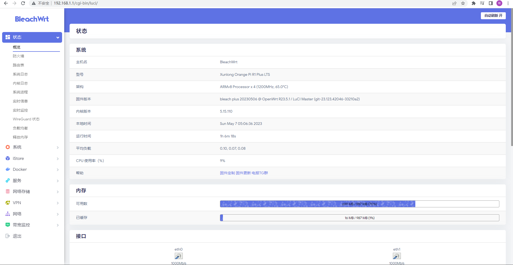

# 香橙派打造软路由

## 硬件介绍

### Orange Pi R1 Plus <strong>LTS</strong>（软路由）此产品定位即为了打造路由器

官方参数如下：



官方自带有openwrt、ubuntu、debian固件等，but相信大家伙眼界没有受限于此

博主也建议选择社区版本openwrt固件这样优点很明显，能够拥有更多你想要的功能，废话不多说

## 固件引用

[官方固件](http://www.orangepi.cn/html/hardWare/computerAndMicrocontrollers/service-and-support/Orange-Pi-R1-Plus-LTS-Router.html)

[推荐固件(如果你与博主用的硬件一样请选择最后一个镜像下载)](https://openwrt.mpdn.fun:8443/?dir=lede/rockchip/2023-05-06__02-20-59--multiple-devices.plus-daily)

## 安装固件

### 需要条件：

1、microSD卡（读卡器）

2、[烧录工具](https://win32diskimager.org/)

3、固件镜像文件

### 操作步骤：

1、下载镜像文件、烧录工具

2、插入读卡器（microSD卡）

3、烧录系统（烧录好后千万不要格式化）

4、插上Pi 直接可以启动



## 启动路由器

### 操作步骤

1、连接电源，插上SD卡，连接lan网口至PC

2、PC检查网络连接找到IPv4 DNS服务器ip地址



3、浏览器访问该网址：[默认为192.168.1.1](http://192.168.1.1)

<strong>出现网站信息即成功！！！</strong>



4、登录openwrt、账号：root、原版没有密码、lean大佬版本密码：password



<strong>祝你好运！！！</strong>

## 附录

### 编译固件

想要自己diy插件功能等，可以自行编译固件，有详细教程，不需要编程知识，要求具备一定互联网搜索解决问题能力。

[源码及编译教程地址](https://github.com/coolsnowwolf/lede)

## 鸣谢

感谢固件提供地址:

```bash
https://openwrt.mpdn.fun:8443/?dir=lede/rockchip
```

感谢openwrt可编译源码

```bash
https://github.com/coolsnowwolf/lede
```

