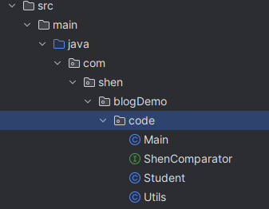
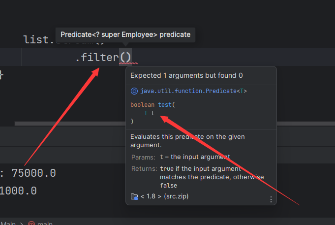

# lambda表达式

对于面向对象对象语言中 lambda表达式其实是不重要的

如果你有了解过JavaScript、你一定对函数式编程比较熟悉(Js太恶心啦！！！ 用的时候看不了规则根本不知道怎么写)


多说无益、先看效果：首先我们先假设有这么一个场景要实现一个数组排序 给定一个数组、将数组按指定要求(正序/倒序)排序

在`Java`中我们可以直接使用`Arrays.sort()`调用JDK中 的方法进行排序(但该方法只提供了正序排序的实现)

```java
public class Sort {

    public static void main(String[] args) {
        int[] nums = new int[]{1,3,5,25,7,23,7,34,8,12,5,3,71,236,12};
        Arrays.sort(nums);
        System.out.println(Arrays.toString(nums));
        // outputL: [1, 3, 3, 5, 5, 7, 7, 8, 12, 12, 23, 25, 34, 71, 236]
    }
}
```

当然sort()方法也可以实现倒序排序、只不过有点不一样

```java
public class Sort {


    public static void main(String[] args) {
        Integer[] nums = new Integer[]{1,3,5,25,7,23,7,34,8,12,5,3,71,236,12}; // 是包装类 Integer 不是int
        Arrays.sort(nums, Collections.reverseOrder());
        System.out.println(Arrays.toString(nums));
        // output: [236, 71, 34, 25, 23, 12, 12, 8, 7, 7, 5, 5, 3, 3, 1]
    }
}
```
ok , 通过这两个简单方法就可以实现我们的功能、但这并不是本问介绍的重点、重点是我们要通过这个案例来学习了解到lambda表达式、并且间接的感受Java函数式编程思想

接下来我们就来实现一个简易版本的`Arrays.sort(T[]nums,Comparable)`
首先确定想要的效果、T[]nums 确定一个任何对象类型的数组、传入一个比较器接口类、该接口仅仅做一件事情就是帮我比较两个数大小，叫做比较器，<strong>当我们的排序数据换成其他对象时候、原始的`+`与`-`已经不能满足我们的需求了、比如比较String 大小 在String中存在CompareTo方法比较两个字符串大小，因此为满足其他复杂数据类型也能够排序、引入比较器来自定义比较两个数据大小尤为重要</strong>
先定义比较器、为了不予Jdk本身接口<strong>(Comparator)</strong>冲突我取名叫`ShenComparator.java`

```java
@FunctionalInterface // 做个约束 改接口只能定义一个属于自己的抽象方法
public interface ShenComparator<T> {

    /**
     * 比较两个数的大小
     * @param o1 第一个数
     * @param o2 第二个数
     * @return > 0 ? 前面的数字大 ： 后面的数字大
     * NOTICE:: 这里不仅仅表示值 比如integer double 等数值 、
     * 可以表示一切对象按照指定规则比较大小
     *
     */

    int compare(T o1,T o2);
    
    // 该方法属于Object(出现在这里属于多余)
    boolean equals(Object obj);

}
```

这里的比较器唯一的规则就是 比较大小结果是大于0还是小于0，举个例子 假设我们需要比较两个Integer类型数字、可以直接将前面数字减去后面的数字相减

```java
// 实现类
// 如果 o1 > o2 结果自然大于零， o1 < o2 结果自然小于零, 如果将结果反序则得到的排序结果也是相反逻辑
int compare(Integer o1,Integer o2) {
    return o1 - o2;
    // return o2 - o1;
}
```

ok、有了比较器也还先别着急、 先用最简易版本的数字排序来熟悉一下排序的过程、这里为了简单我直接用快速排序算法来实现


```java

public class Utils {

    /**
     * 排序
     * @param nums 待排序的数组
     *                   而是一个具体的排序规则 ::
     *                   字符串有字符串的规则
     *                   数字类型有数字类型比较规则
     */
    public static  void  sort(int[] nums) {
        quickSort(nums,0,nums.length - 1);
    }


    private static  void quickSort(int[] nums,int left,int right) {
        if (left >= right)
            return;
        int pivot = partition(nums, left, right);
        quickSort(nums, left, pivot - 1);
        quickSort(nums, pivot + 1, right);
    }

    private static  void swap(int[] nums,int x, int y) {
        int mid = nums[x];
        nums[x] = nums[y];
        nums[y] = mid;
    }

    /* 哨兵划分 */
    private static  int partition(int[] nums, int left, int right) {
        // 以 nums[left] 作为基准数
        int i = left, j = right;
        while (i < j) {
            while (i < j && nums[j] >= nums[left])
                j--;
            while (i < j && nums[i] <= nums[left])
                i++;
            swap(nums, i, j);
        }
        swap(nums, i, left);
        return i;
    }
}
```

现在已经实现了基本的排序功能、但是只针对于int[]数组、而且不支持随意切换正序还是倒序，现在测试一下

```java
public class Main {

    private static final int[] nums = {43,1,56,7,23,12,46,23,8,9,4,23,56,30,23,5};
    public static void main(String[] args) {
        Utils.sort(nums);
        System.out.println(Arrays.toString(nums));
        // output: [1, 4, 5, 7, 8, 9, 12, 23, 23, 23, 23, 30, 43, 46, 56, 56]
    }
}
```

可见基本上排序功能是已经实现了、但是还缺少本文想要描述的重点、假设现在不是一堆数字要排序、而是一堆'学生'对象想通过成绩、年龄或通过名称排序，那该怎么办，接下来就需要引入我们自定义的`比较器接口` 以及给我们的int[] 都替换成 T[] 来实现， 另外我们算法中对排序数比较大小的`-` 和`+`号都可以用comparator.compare（）方法来代替  


加上比较器和泛型后

```java
public class Utils {

    /**
     * 排序
     * @param nums 待排序的数组
     * @param comparator 排序规则比较器 传入不是具体的某一个数据
     *                   而是一个具体的排序规则 ::
     *                   字符串有字符串的规则
     *                   数字类型有数字类型比较规则
     */
    public static <T> void  sort(T[] nums, ShenComparator<T> comparator) {
        quickSort(nums,0,nums.length - 1,comparator);
    }


    private static <T> void quickSort(T[] nums,int left,int right,ShenComparator<T> comparator) {
        if (left >= right)
            return;
        int pivot = partition(nums, left, right,comparator);
        quickSort(nums, left, pivot - 1,comparator);
        quickSort(nums, pivot + 1, right,comparator);
    }

    private static <T> void swap(T[] nums,int x, int y) {
        T mid = nums[x];
        nums[x] = nums[y];
        nums[y] = mid;
    }

    /* 哨兵划分 */
    private static <T> int partition(T[] nums, int left, int right,ShenComparator<T> comparator) {
        // 以 nums[left] 作为基准数
        int i = left, j = right;
        while (i < j) {
            // 替换 nums[j] >= nums[left]
            while (i < j && comparator.compare(nums[j],nums[left]) >= 0)
                j--;
                // 替换nums[i] <= nums[left]
            while (i < j && comparator.compare(nums[i],nums[left]) <= 0)
                i++;
            swap(nums, i, j);
        }
        swap(nums, i, left);
        return i;
    }
}
```

直接测试！

```java
public class Main {


    public static void main(String[] args) {

        Student[] students = new Student[]{
                new Student(18,"lip",99F),
                new Student(19,"dabbe",45.5F),
                new Student(20,"miky",50.5F)};

        Utils.sort(students, new ShenComparator<Student>() {
            @Override
            public int compare(Student o1, Student o2) {
                // 按照成绩从大到小排序
                return  (int)(o2.getScore() -  o1.getScore());
            }
        });
        System.out.println(Arrays.toString(students));
        //output:[Student(age=18, name=lip, score=99.0), Student(age=20, name=miky, score=50.5), Student(age=19, name=dabbe, score=45.5)]
    }
}
```

ok 这里可以看到、我们调用Utils.sort方法时new 了一个匿名类部类 并重写里面的 compare方法来实现传递比较器，这就是自定义排序规则的根本原因。

但是到现在我们还根本没有跟`lambda`表达式沾边、是的、java8 以后匿名类部类可以改写简化成lambda表达式、但是有前提：

<ul>
    <li>该接口中(ShenComparator)只能有一个抽象方法</li>
    <li>也许还有。。。不记得了</li>
</ul>

用lambda表达式改写：

```java
public class Main {


    public static void main(String[] args) {

        Student[] students = new Student[]{
                new Student(18,"lip",99F),
                new Student(19,"dabbe",45.5F),
                new Student(20,"miky",50.5F)};

        Utils.sort(students, (o1, o2) -> (int)(o2.getScore() -  o1.getScore())); // 只需要一行代码及可完成
        System.out.println(Arrays.toString(students));
    }
}
```

```java
 Utils.sort(students,(a,b) -> b.getName().compareTo(a.getName())); // 根据名字倒序排序
```

```java
 Utils.sort(students,(a,b) -> a.getAge() - b.getAge()); // 根据年龄正序排序
```

## 备注

为了更容易理解、贴出类项目结构(额、好像没必要，算了贴都贴了反正就两个重要类ShenComparator 与 Utils)



<strong>建议查看java函数式编程的源码内容本文只是仿照他写的一个简易实现</strong>


## 我是怎么使用Lambda表达式的？

首先Lambda表达式主要用于集合的操作中

其中java `Stream`流配合Lambda表达式对集合操作就非常便捷

比如：假设有一个包含员工信息的列表，我们希望按照部门对员工进行分组，并计算每个部门的平均工资。

```java
public class Main {


    @Data // 为了节省空间就不写setter getter构造方法了 直接用lombok 自动生成了
    @AllArgsConstructor
    static class Employee {
        private String name;
        private String department;
        private double salary;
    }

    public static void main(String[] args) {

        List<Employee> list = Arrays.asList(new Employee("Alice", "HR", 50000),
                new Employee("Bob", "Engineering", 60000),
                new Employee("Charlie", "HR", 55000),
                new Employee("David", "Engineering", 70000),
                new Employee("Eva", "HR", 48000),
                new Employee("Frank", "Sales", 75000));


        Map<String, Double> averageSalaryByDepartment  = list.stream()
                .collect(Collectors.groupingBy(Employee::getDepartment, // 按部门分组
                        Collectors.averagingDouble(Employee::getSalary))); // 求平均值

        averageSalaryByDepartment.forEach((department, salaryAVG) -> System.out.println("Department: " + department + ", Average Salary: " + salaryAVG));
        //output:Department: Engineering, Average Salary: 65000.0
				//Department: Sales, Average Salary: 75000.0
				//Department: HR, Average Salary: 51000.0
    }

}
```

另外使用lambda表达式除了要会查文档外更建议用Idea查看具体需要类型，如 我这里使用filter方法实现过滤功能、但看不明白需要传递参数是什么、可以通过idea查看、需要一个Predicate （断言）接口 、里面一个test方法 返回值为boolean类型 需要一个参数、知道这些信息就可以很轻松写出lambda表达式，不需要new 个匿名类部类再改写。


