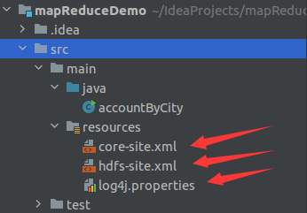
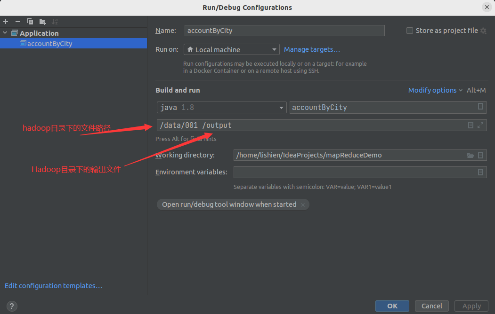
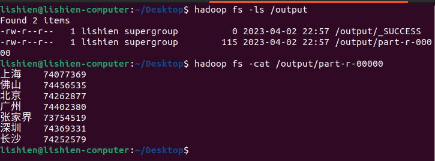

# 模拟电商日志mapRuce计算


## 准备环境

<ul><li>ubuntu22.04虚拟机/物理机</li></ul>

<ul><li>jdk安装以及环境配置</li></ul>

<ul><li>maven安装以及环境配置</li></ul>

<ul><li>hadoop安装以及环境配置</li></ul>

## 日志信息模拟生成

利用javaIO模拟生成100w条购买记录

```yaml
&20320230401170400&Larry&虚拟产品&68.0&3.0&204.0&北京
&66420230401170400&吴九&电脑&56.0&13.0&728.0&北京
&90620230401170400&郑十&牙刷&32.0&9.0&288.0&北京
&60020230401170400&郑十&毛巾&78.0&1.0&78.0&长沙
&23020230401170400&吴九&虚拟产品&61.0&17.0&1037.0&长沙
&70520230401170400&张三&鞋子&70.0&15.0&1050.0&上海
&44620230401170400&王五&牙刷&11.0&7.0&77.0&上海
&18320230401170400&赵六&篮球&48.0&3.0&144.0&上海
&61620230401170400&周八&牙刷&30.0&19.0&570.0&上海
......
&80320230401170400&李四&水杯&19.0&9.0&171.0&北京
&48620230401170400&周八&牙刷&97.0&9.0&873.0&张家界
&43120230401170400&张三&篮球&36.0&6.0&216.0&佛山
&93720230401170400&李四&毛巾&56.0&19.0&1064.0&广州
```

## 构建maven项目

项目结构：将hadoop/etc/hadoop目录下的core-site.xml,hdfs-site.xml,log4g.properties文件分别复制到resources目录下



修改pom.xml 配置文件(博主用的Hadoop2.10.1，jdk1.8 maven3.9)

```xml
<?xml version="1.0" encoding="UTF-8"?>
<project xmlns="http://maven.apache.org/POM/4.0.0"
         xmlns:xsi="http://www.w3.org/2001/XMLSchema-instance"
         xsi:schemaLocation="http://maven.apache.org/POM/4.0.0 http://maven.apache.org/xsd/maven-4.0.0.xsd">
    <modelVersion>4.0.0</modelVersion>

    <groupId>org.example</groupId>
    <artifactId>mapReduceDemo</artifactId>
    <version>1.0-SNAPSHOT</version>

    <repositories>
        <repository>
            <id>apache</id>
            <url>http://maven.apache.org</url>
        </repository>
    </repositories>


    <dependencies>
        <dependency>
            <groupId>junit</groupId>
            <artifactId>junit</artifactId>
            <version>4.12</version>
            <scope>test</scope>
        </dependency>

        <dependency>
            <groupId>org.apache.hadoop</groupId>
            <artifactId>hadoop-common</artifactId>
            <version>2.10.1</version>
        </dependency>

        <dependency>
            <groupId>org.apache.hadoop</groupId>
            <artifactId>hadoop-hdfs</artifactId>
            <version>2.10.1</version>
        </dependency>

        <dependency>
            <groupId>org.apache.hadoop</groupId>
            <artifactId>hadoop-mapreduce-client-core</artifactId>
            <version>2.10.1</version>
        </dependency>

        <dependency>
            <groupId>org.apache.hadoop</groupId>
            <artifactId>hadoop-mapreduce-client-jobclient</artifactId>
            <version>2.10.1</version>
        </dependency>

        <dependency>
            <groupId>log4j</groupId>
            <artifactId>log4j</artifactId>
            <version>1.2.17</version>
        </dependency>
    </dependencies>

</project>
```


计算每个城市对应的购买总金额，accountByCity.java代码如下：

```java
import org.apache.hadoop.conf.Configuration;
import org.apache.hadoop.fs.FileSystem;
import org.apache.hadoop.fs.Path;
//import org.apache.hadoop.io.IntWritable;
import org.apache.hadoop.io.LongWritable;
import org.apache.hadoop.io.Text;
import org.apache.hadoop.mapreduce.Job;
import org.apache.hadoop.mapreduce.Mapper;
import org.apache.hadoop.mapreduce.Reducer;
import org.apache.hadoop.mapreduce.lib.input.FileInputFormat;
import org.apache.hadoop.mapreduce.lib.output.FileOutputFormat;

import java.io.IOException;
import java.util.StringTokenizer;

/**
 * <城市，小计金额>
 *
 * <城市，{小计金额，小计金额...}>
 *
 * <城市，总计金额>
 */
public class accountByCity {
    public static class myMapper extends Mapper<Object,Text, Text, LongWritable> {
        private final static LongWritable account = new LongWritable();
        private Text city = new Text();
        private long startTime;
        @Override
        protected void setup(Context context)throws IOException,InterruptedException{
            super.setup(context);
            startTime = System.currentTimeMillis();

        }
        @Override
        public void map(Object key,Text value, Context context)
                throws IOException,InterruptedException{
//            此处的value是文档中的第一行文本数据
            String msg = value.toString();
            String[] list = msg.split(";&";);
            city.set(list[7]);
            double myDouble = Double.parseDouble(list[6]);
            long myLong = (long)myDouble;
            account.set(myLong);
            context.write(city,account);
        }

        protected void cleanup(Context context) throws IOException,InterruptedException {
            super.cleanup(context);
            long endTime = System.currentTimeMillis();
            long duration = endTime - startTime;
            System.out.println(";MapperTime : ";+ duration+ ";ms";);//获取map计算总时间
        }


    }

    public static class myReduce extends Reducer<Text,LongWritable,Text,LongWritable> {
        private LongWritable result = new LongWritable();
        private long startTime;
        @Override
        protected void setup(Context context) throws IOException,InterruptedException{
            super.setup(context);
            startTime = System.currentTimeMillis();
        }
        //        从这可以看出reduce处理的输入数据是<key,value-list>类型的键值对
        public void reduce(Text key, Iterable<LongWritable> values, Context context)
                throws IOException,InterruptedException{
            int sum = 0;
//            reduce 函数就是对列表value中的数值进行相加
            for(LongWritable val : values) {
                sum += val.get();
            }
            result.set(sum);
//            将结果写入context
            context.write(key,result);
        }
        @Override
        protected void cleanup(Context context) throws IOException,InterruptedException{
            super.cleanup(context);
            long endTime = System.currentTimeMillis();
            long duration = endTime - startTime;
            System.out.println(";ReducerTime :";+duration+"; ms";);//获取reduce计算总时间
        }
    }
    /**
     * 1、accountByCity的main函数
     * 2、main函数主要创建一个job对象，然后对accountBycity任务所需要的map函数，reduce函数，输入文件路径，输出文件路径的信息
     * 进行配置
     */
    public static void main(String[] args) throws Exception{
        Configuration conf = new Configuration();
        Job job = Job.getInstance(conf,";;accountByCity";);//获取一个任务实例
        job.setJarByClass(accountByCity.class);//设置工作类
        job.setMapperClass(myMapper.class);//设置Mapper类
        job.setReducerClass(myReduce.class);//设置Reduce类
        job.setOutputKeyClass(Text.class);//设置输出键值对中的key的类型
        job.setOutputValueClass(LongWritable.class);//设置输出键值对中value的类型
        FileInputFormat.addInputPath(job,new Path(args[0]));//设置输入文件的路径
        FileOutputFormat.setOutputPath(job,new Path(args[1]));
        FileSystem fs = FileSystem.get(conf);//获取HDFS文件系统
        fs.delete(new Path(args[1]),true);//删除输出路径下可能已经存在的文件
 
```

## 运行项目

### 首先启动Hadoop服务

``start-all.sh``

### 上传日志文件到Hadoop的hdfs文件关系系统

关于Hadoop shell指令上传日志文件

假设这是我的日志文件路径``/hadoop/test``

``hadoop fs -mkdir /data``创建一个data目录

``hadoop fs -mkdir /output``创建一个output目录

``hadoop fs -put /hadoop/test /data``上传文件到data目录下

### idea构建项目




### 执行项目

---success

map 100% reduce 100% 说明运行成功    

```yaml
......
23በ቞ 22:57:00 INFO mapred.LocalJobRunner: Finishing task: attempt_local524911839_0001_r_000000_0
23በ቞ 22:57:00 INFO mapred.LocalJobRunner: reduce task executor complete.
23በ቞ 22:57:01 INFO mapreduce.Job:  map 100% reduce 100%
23በ቞ 22:57:01 INFO mapreduce.Job: Job job_local524911839_0001 completed successfully
23በ቞ 22:57:01 INFO mapreduce.Job: Counters: 35
......

```

### 查看生成数据


