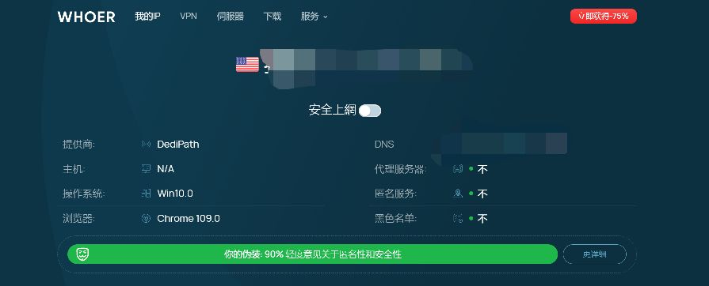
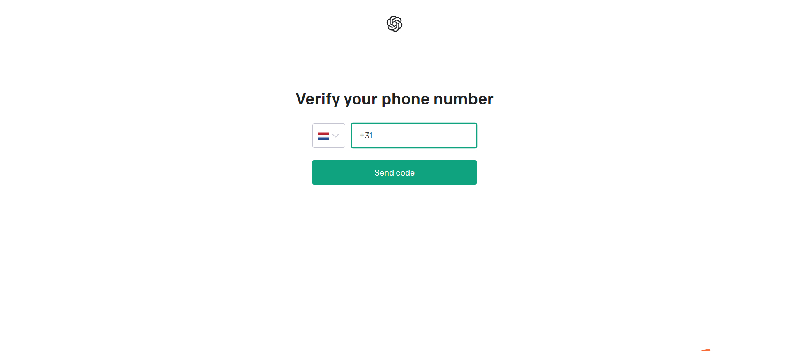
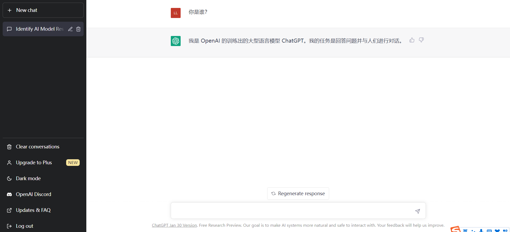

# 国内注册GPT基本步骤扫盲

<strong><em>简要步骤及条件</em></strong>

<ol>
    <li>国外IP(博主选择的USA)</li>
    <li>邮箱(不受限制)</li>
    <li>国外电话号码(靠接码平台)</li>
</ol>

<strong><em>如果你1和3步没有的话预计要花费20RMB！！！</em></strong>

## 代理IP

这里不赘述如何获取国外IP，你可以理解为翻墙，挂梯子，代理上网，科学上网，最好是原生国外ip这里博主使用的USA的ip，注册账号没有压力，我不会推荐你去购买代理ip也不会提供任何有关代理ip的信息，这一切都得由你自己钻研，加油！！！提供一个网站，如果你开启了代理ip的话这里可以显示你的代理位置 [whoer](https://whoer.net/zh "注意如果没有代理ip的话无法访问").

此外，不单单注册需要代理ip，正常使用也需要，故不是真正觉得需要，或者已经具备条件，没必要尝试（劝退）

## 邮箱

邮箱的话没有什么特别的要求~~国内的QQ和163都可以用~~，博主用的outlook邮箱，但个人认为这个邮箱不太好(很多时候收不到邮件，或者很慢)，有gmail或者其他正常邮箱都可以使用：

## 国外电话验证

此步骤需要验证国外电话号码，值得注意的是包括中国本土号码还有好几个国家也是没有chatGPT服务的，但是不用担心，一般找个靠谱的国外接码平台（这类平台提供各种注册账号需要的各国电话号码，利用好他们可以突破各种限制注册很多不在本土服务的账号）即可，这里不推荐任何接码平台，需要的可自行搜索寻找，你可以利用你的国外ip代理访问<em>Google</em>搜索，找个价格能接受,靠谱的网站，一般是通过充值一定金额，博主用过两个。一个支付宝充值了5美刀也就是人民币35元左右，但只用了1美刀的样子，剩下的金额就在账户里下次备用。另一个一次充值只需要一美刀，基本上也用完了

## 步骤

### 进入网站注册

[ChatGPT](https://chat.openai.com/)

选择 Sign up

### 输入邮箱简单填好身份信息

此过程很简单按流程来即可

### 手机验证

这里需要用到接码平台，前面我已经讲清楚了，原理也很简单，看你自己能否找到并利用

### 成功！！！

祝你好运！！！
