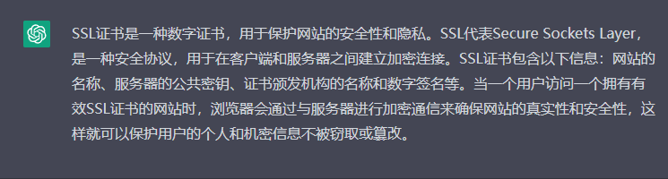
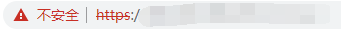
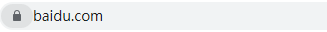
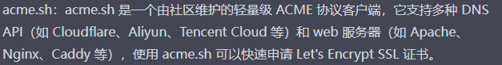
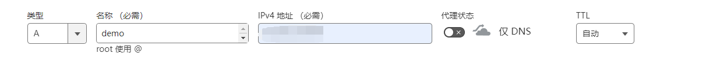
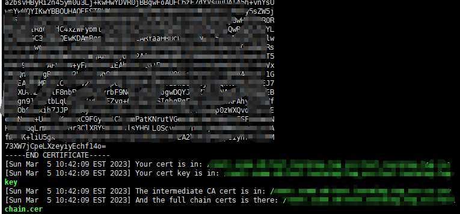

# 服务器申请SSL证书

## 什么是SSL证书?

chatGPT给出这样的答案：



对于普通人理解SSL证书可以这样：很简单，如果你的服务器拥有SSL证书，这样你部署的网站可以通过https(更安全)访问，否则只能通过http访问





事实上我们选择申请SSL证书目的是需要搭建VPS，搭建自己的面板时候需要SSL证书，那这里呢 博主就介绍一种<em>免费</em>申请SSL证书的方式:<strong>acme.sh</strong>脚本搭建

### 什么是acme.sh?

chatGPT给出这样的答案：



## 实际操作

### 基本环境：

<ul>1、Linux操作系统(ubuntu/debain,centOS)</ul>

<ul>2、域名</ul>

### 实践：

<ul>1、域名DNS记录/绑定指定vps(云服务器)ip</ul>

我这里使用cloudFlare绑定指定ip，（如果有需要的话）可以选择多绑定几个



值得注意的是：域名(domain)由两部分组成，顶级域名和二级域名

例如 www. example.com，这里example. com是顶级域名，也就是你自己所购买的域名，www是二级域名，再比如我的demo . example . com，我这里的名称即是demo即是二级域名，下面要填写域名操作要把一级域名和二级域名全部加上（demo . example . com）

<ul>2、Linux环境更新</ul>

```bash
apt update -y          #Debian/Ubuntu 命令
apt install -y curl    #Debian/Ubuntu 命令
apt install -y socat    #Debian/Ubuntu 命令
```

```bash
yum update -y          #CentOS 命令
yum install -y curl    #CentOS 命令
yum install -y socat    #CentOS 命令
```

<ul>2、安装 Acme 脚本</ul>

```BASH
curl https://get.acme.sh | sh
```

<ul>3、注册Acme</ul>

```bash
~/.acme.sh/acme.sh --register-account -m xxxx@xxxx.com #后面是你的个人邮箱
```

<ul>4、更换服务器</ul>

```bash
~/.acme.sh/acme.sh --issue -d demo.example.com --dns dns_cf --server letsencrypt
```

<ul>5、申请SSL</ul>

```bash
~/.acme.sh/acme.sh --issue -d demo.example.com --standalone -k ec-256
```

出现以下信息则说明已经申请成功！



前两行分别是证书公钥和密钥地址，要用到SSL证书直接复制其地址即可


最后祝你好运！！！

### 参考资料

[波仔分享](https://v2rayssr.com/ssl.html#http_%E7%9A%84%E6%96%B9%E5%BC%8F%E9%AA%8C%E8%AF%81%E7%94%B3%E8%AF%B7)

[一瓶奶油](https://www.youtube.com/watch?v=-GNPv3-Q3Es)


