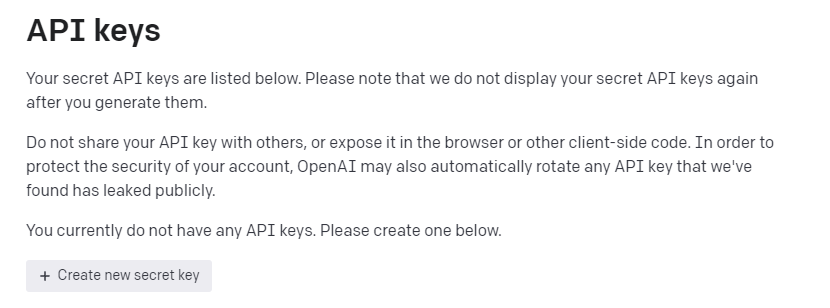

# 调用chatGPT的API(GPT-3.5-turbo)

博主在这里用python编写代码的方式实现调用GPT-3.5-turbo的API实现终端访问chatGPT

## 1、 准备环境

<div>
<ul>
    1、python基本环境 </ul>
<ul>
    2、pip install openai(下载第三方库,改库来自openAI官方)
    </ul>
<ul>
    3、拥有openAI账号(chatGPT账号，没有可以注册一个)
    </ul>
<ul>
    4、具有代理上网能力(全局),或者挂在境外服务器上运行
    </ul></div>

## 2、实践

首先进入openAI_API的官网获取API_Key--->[openAI](https://platform.openai.com/overview)

进入View API keys


点击创建Create new secret key



并复制所创建的API_Key备用

博主这里从官网直接复制并添加润色了以下代码:

```python
# Note: you need to be using OpenAI Python v0.27.0 for the code below to work
import openai
openai.api_key = '你的API'
response = openai.ChatCompletion.create(
  model="gpt-3.5-turbo",
  messages=[
        # {"role": "system", "content": "You are a helpful assistant."},
        {"role": "user", "content": "Who are you?"},#这里content表示输入问题
        # {"role": "assistant", "content": "The Los Angeles Dodgers won the World Series in 2020."},
        # {"role": "user", "content": "Where was it played?"}
    ]
)
print(response['choices'][0]['message']['content'])

```

## 3、结果显示

打印<strong>类似</strong>如下内容说明成功！

```bash
As an AI language model developed by OpenAI, I am not a person or a human being. I am a computer program designed to understand and generate natural language responses to interact with humans.
```

大家对AI感兴趣的可以阅读官方文档--->[openAI_Doc](https://platform.openai.com/docs/introduction)

值得注意的是使用API并不是免费的，但每个账户都有US$ 18的额度

参考视频---> [TechDIYLife](https://www.youtube.com/watch?v=Wm9RpqW_5qc)

