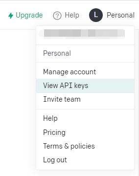
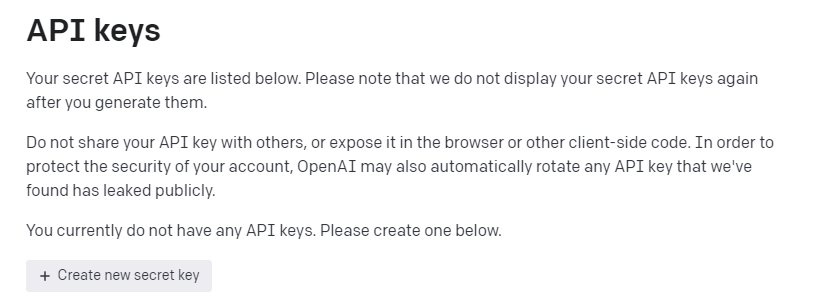
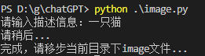
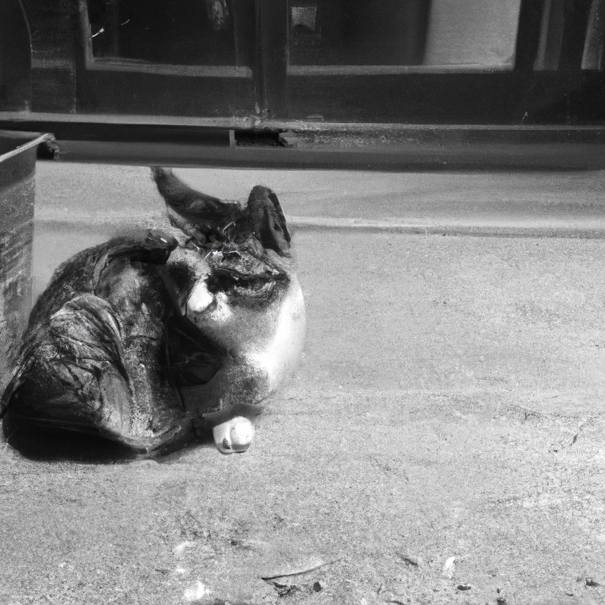

# 调用openAI-Image models的API

调用openAI-Image models的API

博主这里承接上文调用chatGPT的API实现AI对话，接着继续用API实现AI画图

依旧用Python代码实现

## 1、 准备环境

<div>
<ul>
    1、python基本环境 </ul>
<ul>
    2、pip install openai(下载第三方库,改库来自openAI官方)、pip install requests</ul>
<ul>
    3、拥有openAI账号(chatGPT账号，没有可以注册一个)
    </ul>
<ul>
    4、具有代理上网能力(全局),或者挂在境外服务器上运行
    </ul></div>


## 2、实践

首先进入openAI_API的官网获取API_Key--->[openAI](https://platform.openai.com/overview)

进入View API keys



点击创建Create new secret key



并复制所创建的API_Key备用

博主这里从官网直接复制代码，并添加了存储本地功能:

```python
import openai
import os
import requests
def image(prompt):
    openai.api_key = '你自己的API_Key'
    response = openai.Image.create(
    prompt=prompt,
    n=1,
    size="1024x1024"
    )
    image_url = response['data'][0]['url']
    # 存储图片
    fileDown(image_url)


def fileDown(url):
    if not os.path.exists('./image'):
        os.mkdir('./image')
    headers={
            "User-Agent":"Mozilla/5.0(Windows NT 10.0;Win64;x64) AppleWebKit / 537.36(KHTML, likeGecko) Chrome / 88.0.4324.150 Safari / 537.36"
        }
    res = requests.get(url=url,headers=headers).content
    src_path = './image/' +url.split('/')[-1]+ '.jpg'
    with open(src_path,'wb') as fp:
        fp.write(res)

if __name__ == "__main__":
    prompt = input('请输入描述信息：')
    print('请稍后...')
    image(prompt=prompt)
    print('完成，请移步当前目录下image文件...')
```

## 3、运行结果截图





效果如大家所见，就是难以形容，大家可以自己尝试一下！！！

大家对AI感兴趣的可以阅读官方文档--->[openAI_Doc](https://platform.openai.com/docs/introduction)

值得注意的是使用API并不是免费的，每张1024*1024的图片花费 $0.020，但每个账户都有$18的额度
