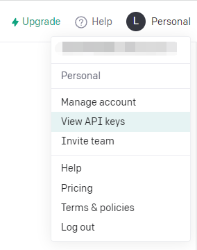

# 音频转文字

书接上回，AI图片生成，问答生成，接下来博主继续介绍 openAI的音频转换API，实现音频提取并翻译(->English)文字

## 1、 准备环境

<div>
<ul>
    1、python基本环境 </ul>
<ul>
    2、pip install openai(下载第三方库,改库来自openAI官方)</ul>
<ul>
    3、拥有openAI账号(chatGPT账号，没有可以注册一个)
    </ul>
<ul>
    4、具有代理上网能力(全局),或者挂在境外服务器上运行
    </ul></div>


## 2、实践

首先进入openAI_API的官网获取API_Key--->[openAI](https://platform.openai.com/overview)

进入View API keys



点击创建Create new secret key


并复制所创建的API_Key备用

博主依旧是润色官网代码实现功能：

<ul>1、提取文字(不翻译)</ul>

```python
# Note: you need to be using OpenAI Python v0.27.0 for the code below to work
import openai

openai.api_key = "your API_Key"
audio_file= open("./demo2.mp3", "rb") #路径修改为你的音频文件路径
# 音频转化为文字
response = openai.Audio.transcribe("whisper-1", audio_file)
print(response['text'])
```

<ul>2、提取文字并翻译为英文</ul>

```python
# Note: you need to be using OpenAI Python v0.27.0 for the code below to work
import openai

openai.api_key = "your API_Key"
audio_file= open("./demo2.mp3", "rb") #路径修改为你的音频文件路径
# 音频转化为文字并翻译为英文
response = openai.Audio.translate("whisper-1",audio_file)
print(response['text'])
```

## 3、运行截图


## 4、总结

相比于图形生成其效果还可以，也许适用于做短视频的字幕生成。

大家对AI感兴趣的可以阅读官方文档--->[openAI_Doc](https://platform.openai.com/docs/introduction)

值得注意的是使用API并不是免费的，每分钟的音频计费$0.006，但每个账户都有$18的额度
